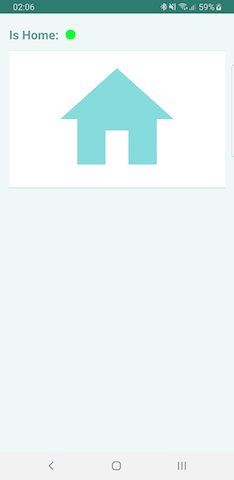

# im-home

This is a sample HomeAssist Android App which intented to help user manage their home information and connecting various home smart devices in future phases. 

In the first phase, ImHome allow home owner to record their home's coordinate location and WiFi network SSID, whereby the app will detect if the home owner's device is homed. The app will detect if the device is located inside of a pre-defined area(GeoFence Area) using Google Geofence.

Geofence area is defined as a combination of some geographic point, radius, and specific Wifi network name. A device is considered to be inside of the geofence area if the device is connected to the specified WiFi network or remains geographically inside the defined circle.

Screenshots
------------

Libraries Used
--------------
* [Foundation][0] - Components for core system capabilities, Kotlin extensions and support for
  multidex and automated testing.
  * [AppCompat][1] - Degrade gracefully on older versions of Android.
  * [Android KTX][2] - Write more concise, idiomatic Kotlin code.
* [Architecture][10] - A collection of libraries that help you design robust, testable, and
  maintainable apps. Start with classes for managing your UI component lifecycle and handling data
  persistence.
  * [Data Binding][11] - Declaratively bind observable data to UI elements.
  * [LiveData][13] - Build data objects that notify views when the underlying database changes.
  * [ViewModel][17] - Store UI-related data that isn't destroyed on app rotations. Easily schedule
     asynchronous tasks for optimal execution.
* [UI][30] - Details on why and how to use UI Components in your apps - together or separate
  * [Fragment][34] - A basic unit of composable UI.
  * [Layout][35] - Lay out widgets using different algorithms.

[0]: https://developer.android.com/jetpack/foundation/
[1]: https://developer.android.com/topic/libraries/support-library/packages#v7-appcompat
[2]: https://developer.android.com/kotlin/ktx
[10]: https://developer.android.com/jetpack/arch/
[11]: https://developer.android.com/topic/libraries/data-binding/
[13]: https://developer.android.com/topic/libraries/architecture/livedata
[17]: https://developer.android.com/topic/libraries/architecture/viewmodel
[34]: https://developer.android.com/guide/components/fragments
[35]: https://developer.android.com/guide/topics/ui/declaring-layout

Upcoming Features
------------
Updates will include home device sync, login and more...

